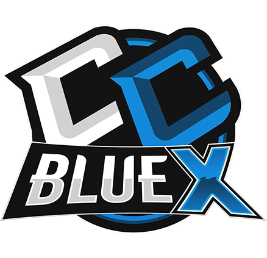
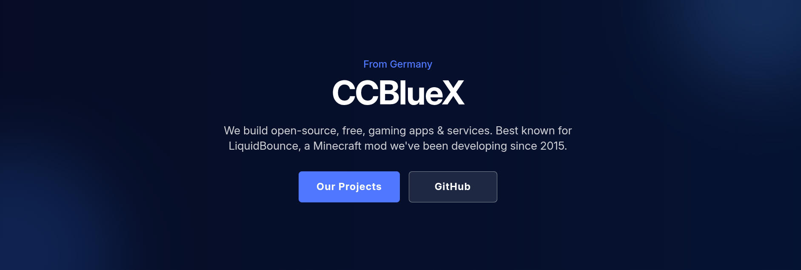
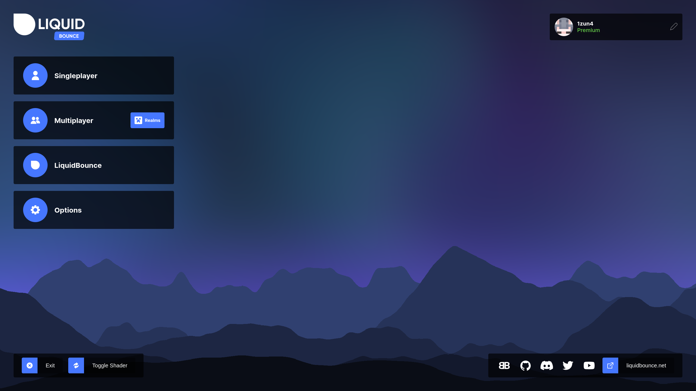
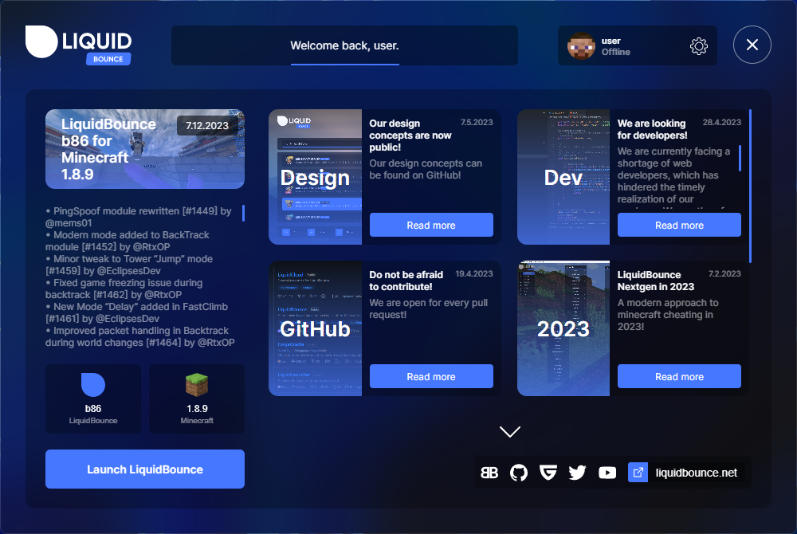
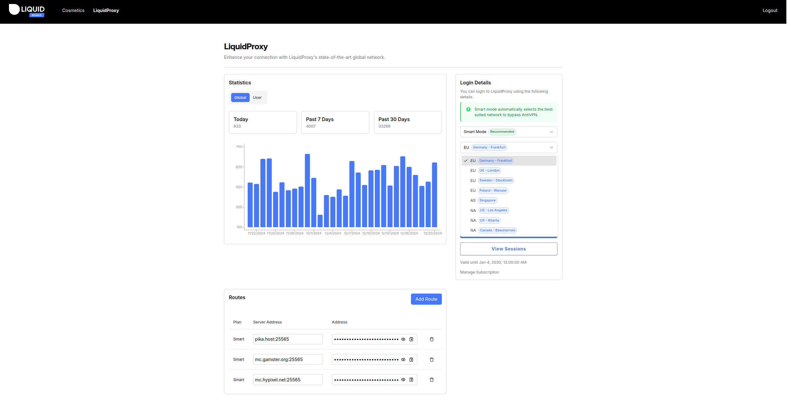
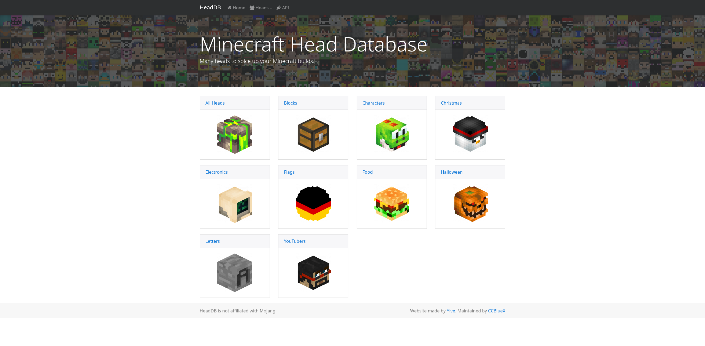
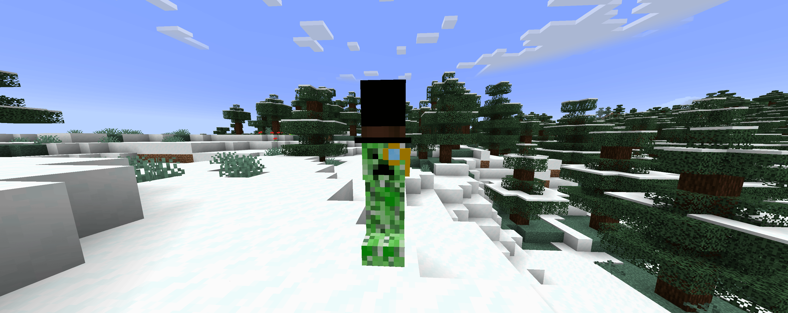

  

# CCBlueX

---

## Apps & Services

### [LiquidBounce](https://liquidbounce.net/)

A free, open-source Minecraft utility client built with Fabric.

---

### [LiquidLauncher](https://github.com/CCBlueX/LiquidLauncher)

The official launcher for LiquidBounce for automatic installation and updating.

---

### [LiquidProxy](https://liquidproxy.net/)

A proxy network service for Minecraft Java Edition. Connect to any server with Dedicated or Residential IPs at low cost with premium quality.

---

### [HeadDB](https://headdb.org/)

A Minecraft head database with thousands of custom player head textures for decorating builds. Categories include blocks, characters, food, flags, and more.

---

### [Classy Creepers](https://cc.senkju.net/)

A Minecraft mod. Puts top hats on creepers.

---

## Team

| Handle | Role |
|---|---|
| [@1zun4](https://github.com/1zun4) | Full-Stack Developer & Founder |
| [@SenkJu](https://github.com/SenkJu) | Frontend Developer & Co-Founder |
| [@superblaubeere27](https://github.com/superblaubeere27) | Software Engineer |
| [@NurMarvin](https://github.com/NurMarvin) | Frontend Developer |
| [@benjarobbi](https://github.com/benjarobbi) | Server Administrator |
| [@scorpion3013](https://github.com/scorpion3013) | Customer Support |
| [@NULLYUKI](https://github.com/NULLYUKI) | Customer Support |

---

## Tech Stack

  
  
  
  
  

---

## Contribute

Major projects are open-source. Issues and pull requests are welcome in each repository.

---

## Links

  
  
  
  
  

